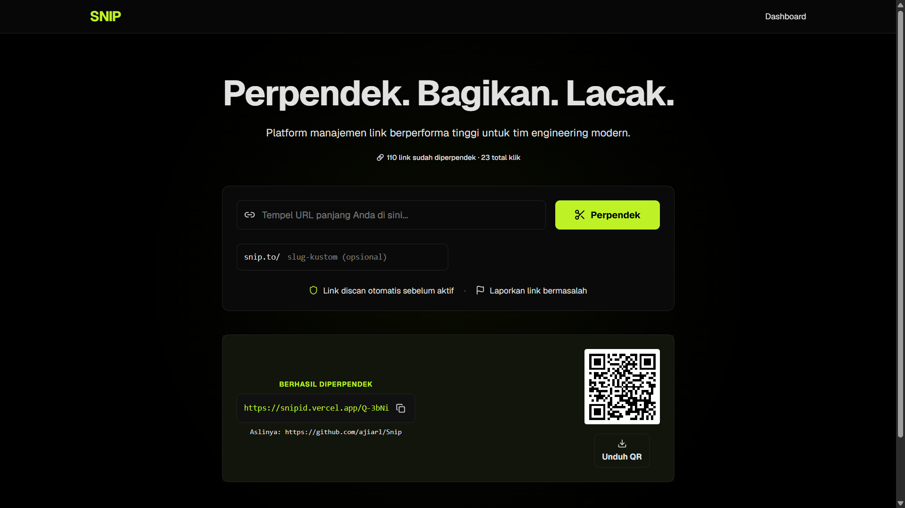

# SNIP

**Shorten. Share. Track.**


## 🔗 Live Demo
**[https://snipid.vercel.app](https://snipid.vercel.app)**

Modern, self-hostable link shortener built with Next.js 16, TypeScript, and Supabase. Designed for developers who want full control over their data without sacrificing features or security.


---

## ✨ Features

- 🔗 **Shorten URL** — Generate short links with auto-generated or custom slugs
- 🔄 **Redirect** — Fast redirects via dedicated Node.js middleware with fail-safe 404 handling
- 📊 **Analytics** — Track total clicks, unique visitors, and daily trends with privacy-first IP hashing
- 📈 **Web Analytics** — Privacy-first page view tracking via Cloudflare Web Analytics
- 🐛 **Error Tracking** — Production error monitoring via Sentry with source map support
- 🎨 **QR Code** — Auto-generate QR codes for every short link with PNG download
- 🛡️ **Security** — Automatic URL scanning with Google Safe Browsing API, rate limiting, and reserved slug protection
- 🚩 **Report Abuse** — Built-in abuse reporting system for community safety
- 🔐 **Guest Mode** — No login required, links stored per session with anonymous cookies
- 🎯 **Dashboard** — Manage all your links: edit destination URLs, toggle status, delete, and view analytics
- 🌙 **Dark Theme** — Modern dark UI with lime accent and full accessibility support

---

## 🛠️ Tech Stack

| Layer | Technology | Purpose |
|-------|-----------|---------|
| **Framework** | Next.js 16 (App Router) | Modern React framework with server components |
| **Language** | TypeScript 5.7 | Type-safe development |
| **UI Library** | shadcn/ui + Tailwind CSS v4 | Beautiful, accessible components |
| **Icons** | Lucide React | Clean, consistent iconography |
| **ORM** | Drizzle ORM | Lightweight, edge-compatible database toolkit |
| **Database** | Supabase Postgres | Managed PostgreSQL with free tier |
| **Validation** | Zod | Schema validation for client & server |
| **Toast** | Sonner | Elegant toast notifications |
| **Charts** | Recharts | Interactive analytics visualization |
| **QR Code** | qrcode | QR code generation |
| **Security** | Google Safe Browsing API | Malicious URL detection |
| **Deployment** | Vercel | Optimized for Next.js with edge functions |
| **Error Tracking** | Sentry | Production error monitoring & alerting |
| **Web Analytics** | Cloudflare Web Analytics | Privacy-first page view tracking |

---

## 🚀 Quick Start

### Prerequisites

- Node.js 18+ (Node 20+ recommended)
- npm or pnpm
- Supabase account (free tier)
- Google Cloud account for Safe Browsing API key (free, no billing required)

### 1. Clone the repository

```bash
git clone https://github.com/ajiarl/Snip.git
cd Snip
```

### 2. Install dependencies

```bash
npm install
```

### 3. Setup environment variables

Copy `.env.example` to `.env` and fill in your credentials:

```bash
cp .env.example .env
```

Required environment variables:
- `DATABASE_URL` — Your Supabase Postgres connection string
- `SAFE_BROWSING_API_KEY` — Google Safe Browsing API key
- `NEXT_PUBLIC_APP_URL` — Your app URL (http://localhost:3000 for local dev)
- `IP_HASH_SALT` — Random string for IP hashing (generate a secure random string)
- `NEXT_PUBLIC_SENTRY_DSN` — Sentry DSN for error tracking (optional for local dev, required for production error tracking)

**Getting Supabase Connection String:**
1. Go to [supabase.com](https://supabase.com) → Create new project (free)
2. Project Settings → Database → Connection String (URI mode)
3. Copy the connection string

**Getting Google Safe Browsing API Key:**
1. Go to [Google Cloud Console](https://console.cloud.google.com)
2. Create new project (or select existing)
3. APIs & Services → Library → Search "Safe Browsing API" → Enable
4. APIs & Services → Credentials → Create Credentials → API Key
5. **No billing required** — Safe Browsing API is free for non-commercial use

### 4. Run database migrations

```bash
npm run db:migrate
```

### 5. Start development server

```bash
npm run dev
```

Open [http://localhost:3000](http://localhost:3000) to see the app running.

---

## 📦 Deployment

### Deploy to Vercel (Recommended)

1. Push your code to GitHub
2. Go to [vercel.com](https://vercel.com) → Import your repository
3. Add environment variables in Vercel dashboard:
   - `DATABASE_URL` (same Supabase connection string)
   - `SAFE_BROWSING_API_KEY`
   - `NEXT_PUBLIC_APP_URL` (your production domain)
   - `IP_HASH_SALT`
   - `NEXT_PUBLIC_SENTRY_DSN` (your Sentry DSN for error tracking)
4. Deploy!

Vercel will automatically build and deploy your app. The same Supabase database is used for both local development and production.

---

## 🧪 Development

### Available Scripts

- `npm run dev` — Start development server with Turbopack
- `npm run build` — Build for production
- `npm run start` — Start production server
- `npm run lint` — Run ESLint
- `npm run typecheck` — Run TypeScript type checking
- `npm run test` — Run unit tests (Vitest)
- `npm run test:watch` — Run unit tests in watch mode
- `npm run test:e2e` — Run E2E tests (Playwright) - **requires dev server running**
- `npm run db:generate` — Generate Drizzle migration files
- `npm run db:migrate` — Run database migrations
- `npm run db:studio` — Open Drizzle Studio (database GUI)

### Running Tests

**Unit Tests** (no setup required):
```bash
npm run test
```

**E2E Tests** (requires setup):
```bash
# First time only: Install Playwright browsers
npx playwright install

# Start dev server in one terminal
npm run dev

# Run E2E tests in another terminal
npm run test:e2e
```

E2E tests require a running dev server and valid `.env` configuration with database access.

### Project Structure

```
snip/
├── app/                    # Next.js App Router pages
│   ├── page.tsx           # Homepage (shorten form)
│   ├── dashboard/         # Dashboard pages
│   ├── not-found.tsx      # 404 page
│   └── api/               # API routes
├── components/            # React components
│   ├── ui/                # shadcn/ui components
│   ├── QRCode.tsx
│   ├── ReportDialog.tsx
│   └── SkeletonLoaders.tsx
├── lib/                   # Utility functions
│   ├── db.ts              # Drizzle client
│   ├── validate-url.ts    # URL & slug validation (Zod)
│   ├── safe-browsing.ts   # Google Safe Browsing integration
│   ├── slug.ts            # Slug generation
│   ├── ratelimit.ts       # Rate limiting
│   └── hash-ip.ts         # IP hashing for privacy
├── drizzle/               # Database schema & migrations
│   └── schema.ts          # Drizzle schema definitions
├── proxy.ts               # Redirect handler (Node.js runtime)
└── reserved-slugs.json    # Reserved slug list
```

---

## 📊 Quality & Performance

- Lighthouse score: Performance 95, Accessibility 100, Best Practices 100, SEO 100 (audited on production, mobile)

---

## 🤝 Contributing

We welcome contributions! Please read our [CONTRIBUTING.md](./CONTRIBUTING.md) for guidelines on how to submit issues, feature requests, and pull requests.

---

## 📄 License

This project is licensed under the MIT License — see the [LICENSE](./LICENSE) file for details.

---

## 🙏 Acknowledgments

- Built with [Next.js](https://nextjs.org)
- UI components from [shadcn/ui](https://ui.shadcn.com)
- Database by [Supabase](https://supabase.com)
- Icons by [Lucide](https://lucide.dev)
- URL safety by [Google Safe Browsing](https://safebrowsing.google.com)
- Error tracking by [Sentry](https://sentry.io)
- Analytics by [Cloudflare](https://cloudflare.com)

---

**Made with ❤️ by [Aji Arlando](https://github.com/ajiarl)**

### SEO & Analytics
- To verify your domain on Google Search Console, add your token to GOOGLE_VERIFICATION_TOKEN in your environment variables.
